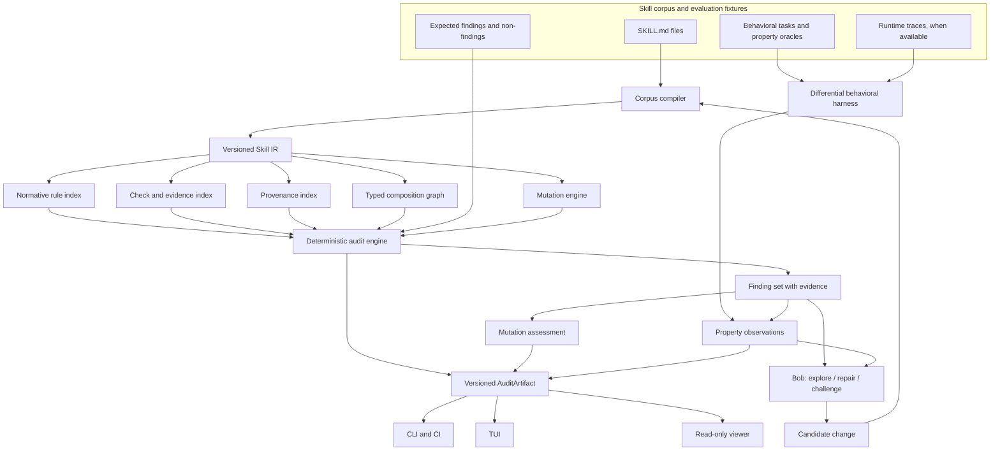

[English](README.md) · [Español](README_ES.md) · **[Technical README](TECHNICAL.md)**

# Crucible — Technical README

**Status: L5 has saved real Nebius/Nemotron evidence; L7 has one privately captured, accepted synthetic-fixture run.** A real confirmation run completed 14 responses (2 confirmed, 12 rejected), but its full artifact was not retained. The L7 run verifies one proposal, deterministic re-audit and seeded behavioral replay; it does not establish repair accuracy or stability. Implementation labels below do not establish cross-run stability.


## 1. System thesis

An agent skill is not merely Markdown. It is a portable methodology that can change an agent's decisions across tasks. Therefore, a corpus needs more than file validation and security scanning. It needs an inspectable representation of:

- what the skill claims;
- when it activates;
- what it requires, forbids, or permits;
- what evidence can verify those requirements;
- which other methodologies it composes with;
- whether the combined corpus remains coherent;
- whether deliberate defects are detected;
- whether the declared methodology changes observable agent behavior.

Crucible's central boundary is:

```text
Bob / an LLM may investigate and propose.
Crucible's deterministic core decides whether the evidence satisfies the contract.
```

An optional model may narrate or rank candidates after the deterministic artifact exists. It is not the authority for a consequential verdict.

Current external boundary: NVIDIA's public ecosystem already covers security scanning, validation, semantic overlap/deduplication, live agent evaluation, signatures, Skill Cards, and benchmark artifacts. CRUCIBLE therefore narrows its intended contribution to methodology-level IR, typed conditional composition, requirement-to-oracle coverage, and mutation testing of the verifier. See [`docs/COMPETITIVE_BOUNDARY.md`](docs/COMPETITIVE_BOUNDARY.md). The boundary remains partly experimental: conditional contradiction, inferred invariants, and marginal utility are `UNKNOWN / NEEDS EXPERIMENT` until fixtures establish them.

## 2. Destination architecture



The artifact is the integration contract. All interfaces consume the same artifact; none reimplements decision logic.

## 3. Construction levels

The levels are coherent product states, not technical departments. Security, determinism, provenance, and authority boundaries apply from the first level that needs them.

| Level | Coherent state | Exit evidence |
|---|---|---|
| L1 | Corpus compiler and versioned Skill IR | **Implemented:** a real corpus compiles with stable identities, source spans, nested/block frontmatter support within the declared subset, and a deterministic artifact digest. |
| L2 | Deterministic single-corpus auditor | **Implemented:** the auditor consumes the L1 IR, emits evidence-bearing findings with epistemic status (CONFIRMED / CANDIDATE / OBSERVATION), seals an AuditArtifact (`crucible-audit/v1`), and emits 29 deterministic checks across methodology and engineering defects. Cross-process digest verified identical. |
| L2.5 | Semantic confirmation layer | **Implemented:** `confirm.py` takes all CANDIDATE findings and asks an executor (Nemotron via Nebius, or deterministic mock) whether each is a true defect or false positive. The confirmation is a separate `crucible-confirmation/v1` artifact; the L2 audit is never modified. An explicitly selected remote executor without `NEBIUS_API_KEY` is BLOCKED, not simulated. Explicit local/mock execution is supported. |
| L3 | Typed composition graph | **Implemented:** the graph extracts typed relation edges from L1 section headings and description text (sibling of, pairs with, composes with, member of the family, companion to), classifies them into composition/reinforcement/delegation, and detects hubs, broken edges, disconnected components, and isolated skills. A historical corpus run produced 83 edges, 12 hubs and 4 components; these counts are not a current corpus guarantee. Three semantic checks are abstained (conditional contradiction, semantic redundancy, producer/consumer typing). |
| L4 | Mutation laboratory | **Implemented:** the lab seeds 8 defect classes (polarity inversion, exception removal, reference break, check removal, trigger widening, edge removal, cycle introduction, capability duplication) against a known-good base fixture, runs the full pipeline, and classifies results as KILLED / SURVIVED / ABSTAINED. Current result: 6/6 killed in scope, 2 abstained as OUT_OF_SCOPE, 0 survived. |
| L5 | Behavioral differential harness | **Executed locally and on Nebius:** four skill variants and four lexical properties; the saved real run distinguishes the mutant on P3 with no truncation. Single-run evidence does not establish generalization. |
| L6 | Bob engineering workflow | **Implemented:** proposal, compilation and deterministic re-audit gate. Rule-based path verified; real LLM proposal was exercised through the captured L7 path, but standalone L6 evidence remains pending. |
| L7 | Closed repair loop | **Implemented and exercised live once:** a captured synthetic-fixture run passed deterministic re-audit and seeded behavioral replay. This is path evidence only; repair accuracy and cross-run stability remain unevaluated. See [captured repair evidence](docs/REPAIR_EVIDENCE.md). |
| L8 | Repository/CI integration and read-only viewer | **Implemented:** a composite report generator runs the full L1-L7 pipeline and seals a `crucible-report/v1` artifact with all level digests. A read-only HTML viewer renders any sealed artifact JSON as a self-contained page (no `<script>`, no computation, only `html`/`json`/`typing` imports). A GitHub Actions CI workflow runs tests, generates the report, renders HTML, and uploads both as artifacts. No consumer has independent decision logic. |
| L9 | Style-agnostic extraction | **Implemented:** extraction accepts equivalent methodology expressed through varied Markdown styles while preserving source evidence and deterministic IR output. |
| L10 | Engineering defect taxonomy | **Implemented:** eight engineering checks cover secrets, silent failures, credentials, resource bounds, input validation, timeouts, floating-point decision paths, and dependency pinning. |
| L11 | Public API and demo surface | **Implemented:** the CLI exposes single-skill, directory, and installed-skill scan modes plus a FastAPI-compatible serving path and read-only report viewer. |
| L12 | Nemotron confirmation | **Executed with mock and real provider:** 14 real responses completed; the full artifact was not retained. Confirmation remains a separate observation and does not modify audit authority. |
| L13 | Corpus-agnostic validation | **Implemented:** validation runs against 10 skills from 7 sources, with deterministic contracts and provenance-preserving fixtures. |
| L14 | Real-runtime boundary and activation integrity | **Implemented for L5:** real Nebius execution is non-blocked; provider envelopes are validated; truncation is recorded; the task explicitly activates the methodology; and the sealed four-way run distinguishes the polarity mutant from original and repair. |
| L15 | Final LLM report and multi-format delivery | **Implemented and run live end to end.** `recommendation.py` computes one of KEEP/NEEDS_CONFIRMATION/MODIFY/DELETE per skill from L2 findings + L2.5 confirmation verdicts (never from the LLM); `narrator.py` has an LLM phrase that decision in prose with a per-finding citation list, checked for traceability against the sealed findings after the fact (`untraceable_finding_ids`); `final_report.py` seals the combined per-skill result; `final_report_render.py` projects it to Markdown, self-contained HTML, and PDF (`reportlab`, optional `[report]` extra). The full pipeline (`crucible --narrate` then `--render-report --render-format {markdown,html,pdf}`) ran live against Nebius/Nemotron, not just mocked; a live run surfaced and fixed a real citation-extraction gap (Unicode dash variants in the model's output) -- see the [L15 review](docs/red-team/2026-10-01-l15-recommendation-narrator-review.md) and live evidence in `docs/evidence/2026-10-01-l15-render-live-run/`. Not done: a `--narrate`/`--render-report` round trip through a single combined CLI command (currently two steps), and evaluation against a corpus larger than the one-skill README fixture. |

The project may stop at any last fully closed level. It must not claim later levels merely because their interfaces exist.

## 4. Skill IR contract and destination schema

The implemented envelope is `skill-ir/v1`: `schema_version`, `skills`, and
`artifact_digest`. Each skill retains `identity`, `metadata`, `trigger`,
`body_text`, `rules`, `checks`, `procedural_steps`, `relations`, and `references`.
See [compiler.py](src/crucible/compiler.py) for the nested extraction fields.
`identity` contains name, source path and exact source-byte digest. Relations
contain composition/delegation targets; URL references are a separate field.

[ir.py](src/crucible/ir.py) serializes canonical JSON using sorted keys,
compact separators, unescaped Unicode and UTF-8 encoding. Payload digests use
SHA-256 with a `sha256:` prefix; the artifact seal excludes its own digest field.
Reproducibility covers identical input/configuration and implementation, not
repeatable remote model generation or authenticity of a resealed artifact.

The following is a **destination design**, not the current serialized API.
Normalized subjects/predicates, per-rule oracle links and general scope semantics
must not be inferred from its presence here:

```yaml
SkillIR:
  schema_version: 0.x
  identity:
    name: stable-name
    source_path: relative/path/SKILL.md
    content_digest: sha256:...
  metadata:
    description: ...
    declared_triggers: []
    license: ...
  scope:
    inclusions: []
    exclusions: []
    source_spans: []
  rules:
    - id: rule-local-id
      modality: MUST | MUST_NOT | SHOULD | SHOULD_NOT | MAY
      subject: normalized capability or actor
      predicate: normalized obligation
      conditions: []
      exceptions: []
      source_spans: []
  checks:
    - id: check-local-id
      target_rule_ids: []
      oracle_kind: explicit | structural | behavioral | human_required
      source_spans: []
  relations:
    composes_with: []
    delegates_to: []
    references: []
  claims:
    - text: ...
      numeric: false
      provenance_refs: []
      source_spans: []
```

The IR must preserve raw text and source spans. Normalization creates analysis views; it must not erase the original evidence. L1 currently supports the bounded frontmatter subset recorded in [ADR-0002](docs/decisions/0002-conservative-frontmatter-parser.md); it does not claim full YAML semantics.

## 5. Finding taxonomy

Initial finding classes are deliberately narrower than “bad skill”:

- `BROKEN_REFERENCE` — a declared reference or composition target cannot be resolved.
- `ORPHAN_SKILL` — a corpus-level graph observation, not automatically a defect.
- `COMPOSITION_CYCLE` — a cycle exists in a relation whose semantics prohibit cycles.
- `NORMATIVE_CONFLICT` — incompatible modalities/predicates overlap under compatible conditions.
- `SCOPE_TRIGGER_MISMATCH` — activation claims and declared scope disagree.
- `REQUIREMENT_WITHOUT_CHECK` — a normative rule has no identified verification path.
- `CHECK_WITHOUT_ORACLE` — a check claims verification without a falsifiable oracle.
- `CLAIM_WITHOUT_PROVENANCE` — a claim requiring external support lacks a source.
- `DESCRIPTION_BODY_GAP` — the public promise has no corresponding rule/check evidence.
- `STRUCTURAL_REDUNDANCY` — substantial duplicate methodology, distinct from composition.
- `MUTATION_SURVIVED` — the auditor failed to detect a seeded defect that should be in scope.

Findings must carry source spans, rule IDs, relation IDs, the violated invariant, and an explicit epistemic status. A candidate semantic conflict is not automatically a confirmed defect.

## 6. Composition semantics

Similarity is not a verdict. The table describes intended semantic distinctions;
the current graph extracts lexical relation candidates, not a general typed
producer/consumer proof. Relations should be classified by the decision each skill changes:

| Relation | Meaning | Typical evidence |
|---|---|---|
| Redundancy | Same decision, same scope, no additional boundary | normalized rule overlap and equivalent checks |
| Composition | One skill establishes a property another consumes or specializes | typed producer/consumer edge |
| Reinforcement | Same decision reached from distinct, intentional boundaries | separate scope and compatible obligations |
| Contradiction | Same activation conditions require incompatible decisions | overlapping conditions plus incompatible predicates |

The first implementation may emit candidates when semantic adjudication is not deterministic. It must say `CANDIDATE`, not silently promote uncertainty to a verdict.

## 7. Mutation laboratory

The design inventory below models methodology degradation, not random text noise.
It is broader than the eight implemented cases listed in section 3; it is not a
claim that every row has an executed fixture:

| Mutation | Expected pressure |
|---|---|
| `MUST ↔ MUST_NOT` | normative polarity and contradiction checks |
| remove an exception | boundary and overgeneralization checks |
| break a reference | provenance and graph integrity |
| remove a check | requirement-to-verification coverage |
| add an unsupported numeric claim | claim provenance |
| widen a trigger | activation contamination |
| replace enforcement with an application check | enforcement illusion |
| introduce a prohibited cycle | graph invariants |
| duplicate an existing capability | marginal utility and redundancy |

Every mutant needs a hidden machine-readable expectation: expected findings, expected non-findings, and the property under test. Mutation kill rate is meaningful only when the mutant, oracle, and audit version are pinned.

## 8. Behavioral differential contract

For a selected task, the harness compares:

```text
same task + same agent route
        ├── no skill
        ├── original skill
        ├── mutated skill
        └── candidate repair
```

The harness records observations against explicit properties, not aesthetic preference. A surviving mutant may indicate a weak mutation, weak fixture, ineffective skill, agent override, or insufficient oracle. The report must distinguish these explanations.

## 9. Threat model and authority boundaries

In scope:

- malformed or adversarial `SKILL.md` content;
- misleading metadata, triggers, references, and claims;
- cross-skill composition that creates incompatible obligations;
- mutations designed to evade shallow linting;
- agent-proposed repairs that silence a finding without restoring the property;
- corpus changes between audit runs.

Out of scope for the core claim:

- proving that a skill is globally safe;
- proving that an agent will always follow a skill;
- replacing security scanners for malware, exfiltration, or prompt injection;
- treating an LLM judgment as a formal proof;
- inferring truth from a hash or signature alone.

Trust boundaries:

```text
untrusted skill text ──parse/normalize──> evidence-bearing IR
Bob/model proposal ─────────────────────> untrusted candidate change
deterministic engine ───────────────────> audit artifact authority
artifact projections ───────────────────> CLI/TUI/web/CI consumers
```

The frontend is a viewer. It cannot create a passing finding set by changing presentation data.

## 10. Evidence and reproducibility

Each confirmed result must identify:

- corpus commit and content digests;
- Skill IR schema version;
- auditor version and configuration;
- mutation ID and expected oracle, if applicable;
- task fixture and agent/model route, if behavioral;
- exact observation and artifact path;
- what was not executed or verified.

The project will prefer deterministic output and explicit abstention over an apparently complete but unsupported verdict.

## 11. Model and runtime authority

The NVIDIA model used through Nebius is an experimental behavior generator and observation source, not the authority for deterministic findings. A run must retain model ID, provider/runtime, task digest, corpus/skill digests, sampling controls where available, and the property oracle. A behavioral observation is bounded by that experiment; it is not automatically a universal claim about the methodology.

Imported output from SkillSpector, SkillEvaluator, NVIDIA signatures, or NVIDIA benchmarks is neighboring evidence. It must retain its source, version/commit, artifact identity, and scope. A signature establishes that a directory matches the signed bytes; it does not establish semantic truth. A benchmark establishes what its evaluation measured; it does not establish universal correctness.

The current hackathon requirement matrix and runtime contract are in [`docs/NVIDIA_INTEGRATION.md`](docs/NVIDIA_INTEGRATION.md). The evaluation fixtures and negative controls are in [`docs/EVALUATION_PLAN.md`](docs/EVALUATION_PLAN.md).

## 12. Design decisions

Durable decisions live in [`docs/decisions/`](docs/decisions/). The first architectural decision is recorded in [ADR-0001](docs/decisions/0001-deterministic-core-and-artifact.md).

## 13. Red-team posture

Adversarial reviews have been executed and recorded in [`docs/red-team/`](docs/red-team/), including the [real-runtime review](docs/red-team/2026-09-30-nebius-runtime-red-team.md). They are scoped evidence, not certification of the whole system. Further reviews must attack parser boundaries, normalization collisions, graph semantics, mutation coverage, artifact authority, Bob repair loops, and UI projection integrity.

## 14. License

The project is released under Apache-2.0. See [`LICENSE`](LICENSE).

## 15. Collection reader and known limitations

The independent installed-collection mode discovers nested packages and retains
homonyms by source path. Its sealed envelope records per-package audits and
coverage. It does not infer cross-package composition. Limits are 500 entries,
10,000 visited directories, 1 MB per file and 20 MB admitted input per scan.

`compile_skill_file` opens with `O_NOFOLLOW | O_NONBLOCK`, verifies the descriptor
is regular, reads at most its initial size within the caller's byte allowance,
then compares size/mtime/ctime on that same descriptor. Parsing consumes those
captured bytes without reopening the path. This rejects tested final-symlink
replacement, FIFO and growth cases. Each ancestor is opened with O_DIRECTORY and
O_NOFOLLOW relative to the previous descriptor; replacing an already opened
parent with a symlink cannot redirect the final open. Unsupported platforms fail
visibly. This does not provide an atomic filesystem snapshot. Installed-collection
discovery now uses pinned descriptors with recorded directory/file identities,
100,000 discovery entries and 10,000 admitted directories shared across roots.
Enumeration errors produce partial coverage without hiding valid neighbors;
global limits abort. Symlinks (including dangling entries) and directories named
SKILL.md are reported as errors. Report entries are sorted by source path before
sealing. `compile_corpus` uses the same byte reader with a 1,000,000-byte
per-file cap and preserves corpus-relative source paths. It still resolves its
root (accepting symlink aliases). Iterative `scandir` discovery bounds directories
at 10,000 including the root and entries at 100,000 including unrelated files;
only admitted paths are sorted for canonical output. Enumeration errors propagate
instead of producing a partial corpus. A shared 20,000,000-byte allowance is
enforced by the byte reader, independently of the optional skill-count cap.
Corpus enumeration uses `scandir(fd)` on pinned directories opened component by
component with `O_DIRECTORY | O_NOFOLLOW`. Descriptors close on success and errors.
Pending paths carry recorded `(st_dev, st_ino)` identities for the root,
discovered directories and skills. Reopened directory descriptors are checked
component by component, and the final file descriptor is checked before reading.
Detected replacements fail closed without retaining a descriptor per entry.
Identity metadata is runtime-only and does not enter canonical artifacts.
This does not detect inode reuse or preserve content as it existed at discovery;
same-inode edits before opening are not a snapshot violation detected by this check.
Root resolution and mount changes remain outside this guarantee.
Legacy installed staging now discovers each selected package with
the corpus walker and copies only bounded, identity-checked SKILL.md bytes into
the private temporary tree. Nested paths and package precedence are preserved;
the 500-file and 20 MB budgets are shared across staged packages. Non-skill
attachments are not copied. One traversal budget spans initial root listings
and selected-package discovery: 100,000 entries and 10,000 directories across
all source roots. Root listing streams through a pinned descriptor, charges
each entry before sorting, and counts roots even when empty. Duplicate and
non-package entries consume listing budget; skipped package interiors are not
traversed. The staged corpus is subsequently compiled with its own budget.
Initial listing records root and directory device/inode pairs. Those identities
are retained into selected-package discovery and reads, rejecting detected
replacement rather than resetting the identity at the next stage. Initial root
selection and skipped duplicate contents are not covered by this binding.
Limits bound counts and input, not filesystem latency or all parser
and downstream analysis costs.

- Natural-language contradiction and entailment are not fully decidable from Markdown.
- Trigger overlap may require a conservative candidate classification before behavioral confirmation.
- “Marginal utility” needs an explicit capability model; it must not become a magic score.
- Runtime composition requires traces with enough provenance to distinguish declared and observed activation.
- The final hackathon submission must document which levels are actually complete.

## 16. Offline replay evidence contract

[replay.py](src/crucible/replay.py) implements offline `validate_bundle`,
`dump_bundle`, `load_bundle` and `replay_readiness` for
`crucible-replay-bundle/v1`. The envelope retains the full task and property
definitions, exact variant guidance, pinned oracle identity, requests, responses,
historical observations and digests. Limits are 8,000,000 UTF-8 bytes, 500 variants
and 100 properties. Unknown fields/versions, duplicate JSON keys and nonfinite
constants are rejected.

Integrity is not acceptance. Valid bundles may retain blocked, failed or truncated
runs. Readiness requires complete response metadata and observations; it neither
executes an oracle nor authenticates a provider. Historical behavioral artifacts
are not automatically convertible: missing historical prompts cannot be inferred
from today's fixtures. See the [full contract and verification command](docs/REPLAY_BUNDLE.md).

R2 now includes opt-in `NebiusExecutor.capture_exchange`, preserving actual request
and response bodies without legacy normalization. This is transport evidence,
not a behavioral result or replay bundle. Empty guidance still becomes the legacy
default system prompt on the wire; both original guidance and actual request are
retained. See the [capture contract](docs/REPLAY_BUNDLE.md#executor-transport-capture).
The v2 bundle now embeds validated captures with explicit
`nebius-chat-guidance/v1` prompt transformation, task/variant cross-links and the
lexical oracle's source/runtime fingerprint. The v1 reader is unchanged in scope;
no historical evidence is silently migrated. Request/response projections are
derived from raw bytes on load; missing provider metadata is not synthesized.
See [v2 acquisition and compatibility](docs/REPLAY_BUNDLE.md#capture-backed-bundle-v2).
An optional [private capture journal](docs/REPLAY_BUNDLE.md#incremental-local-journal)
commits raw captures before projection and observations before the next variant.
Its recovery reader distinguishes partial acquisition from a stored complete bundle.
The [journal CLI](docs/REPLAY_BUNDLE.md#journal-cli) now separates acquisition,
offline summary inspection and explicit private-bundle export. R2's bounded
storage/acquisition/export gate is locally verified for the current four-way
Nebius adapter; no new live-provider evidence is claimed. R3 now provides
offline pinned-oracle replay and explicit re-evaluation as separate sealed
results. These compare property statuses and do not authenticate providers or
replay L7 repair acceptance. R3 is locally verified for observation replay;
its adversarial review and negative-control evidence are recorded in
[the review log](docs/red-team/2026-10-01-r3-replay-code-review.md). R4 now has
one privately captured live fixture run, including an accepted outcome and the
earlier truncated attempt; neither bundle authenticates provider identity or
proves general repair quality. The [active plan](docs/NEXT_LEVELS.md) keeps
held-out evaluation and integrated release verification open.

## 17. Runtime and API operations

Python >=3.11 is required. Core dependencies are empty; install `.[test]` for
pytest and `.[api]` for FastAPI/Uvicorn. The CLI defaults to graph output for a
positional corpus; use `--no-graph` for the audit. Without a corpus path,
`--report` runs fixture L4–L7, not a corpus audit. Explicit `--local-executor`
uses local behavior and mock confirmation even when a provider key exists.

| HTTP route | Input and behavior |
|---|---|
| `GET /health` | Health status |
| `POST /scan/skill` | JSON `skill_text`, optional `skill_name` (default `uploaded`); returns IR, audit and graph |
| `POST /scan/directory` | JSON `directory`; scans a path on the server filesystem |
| `GET /scan/installed` | Legacy combined installed-skill scan |
| `GET /` | Interactive local demo |

There is no independent-collection HTTP route. POST handlers translate
`ValueError` into HTTP 400; other filesystem failures are not uniformly
normalized. The API has no public-service authorization boundary. Directory and
installed scans access the server's files: keep it on loopback and do not publish
it without a separately designed access-control and resource-isolation layer.
The HTML artifact viewer is distinct from the interactive demo.

```bash
pip install -e ".[api]"
PYTHONPATH=src python3 -m crucible.cli --serve 127.0.0.1:8000
# Alternative local container deployment:
docker build -t crucible .
docker run -p 127.0.0.1:8000:8000 crucible
```

Custom roots and external plugin caches are not automatically discovered.
Legacy installed scans retain name precedence; `--include-coverage` exposes
omissions and partial scans warn on stderr. Independent collection scans retain
homonyms by path and exit 1 for partial or empty coverage.

## 18. Algorithms and verification entry points

The auditor's lexical redundancy base uses exact rational Jaccard similarity:
`|A intersection B| / |A union B|`, with both empty sets scoring 1 and only one
empty scoring 0. Its threshold is `Fraction(2, 3)`; this is lexical evidence,
not a semantic equivalence proof. See [auditor.py](src/crucible/auditor.py) and
[ADR-0011](docs/decisions/0011-semantic-redundancy-deterministic-base.md).

The key authority decisions are [conservative parsing](docs/decisions/0002-conservative-frontmatter-parser.md),
[honest audit scope](docs/decisions/0003-l2-honest-audit-scope.md),
[Bob proposes, Crucible decides](docs/decisions/0007-l6-bob-proposes-crucible-decides.md),
[behavioral repair gating](docs/decisions/0008-l7-behavioral-replay-in-repair-loop.md),
[no consumer decision logic](docs/decisions/0009-l8-no-consumer-decision-logic.md)
and [separate confirmation](docs/decisions/0018-general-confirmation-layer.md).
These records retain the rationale and alternatives.

```bash
pip install -e ".[test]"
PYTHONPATH=src python3 -m pytest -q
PYTHONPATH=src python3 -m crucible.cli --mutate
PYTHONPATH=src python3 -m crucible.cli --report --local-executor
```

The mutation result is six killed in-scope fixtures and two out-of-scope
abstentions, not a universal detection guarantee. The
[evaluation plan](docs/EVALUATION_PLAN.md) defines the experimental method;
the [saved behavioral artifact](artifacts/nebius/2026-09-30-behavioral-real.json)
retains single-run remote evidence. Re-running local tests does not reproduce
that provider run.
